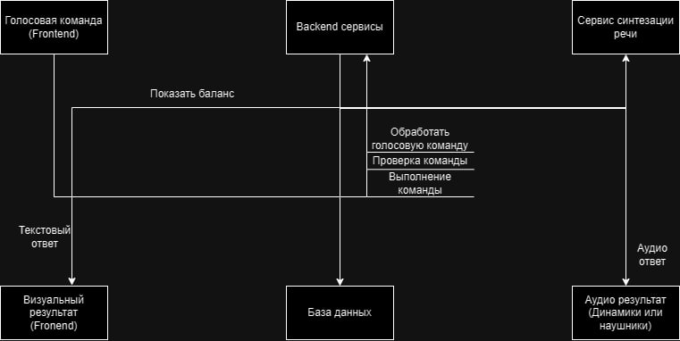

## Руководство по развертке и установке решения

### 1. Клонирование репозитория

```
git clone https://git.codenrock.com/true-tech-hack-1150/cnrprod1714159195-team-68672/true-tech-hack-fintech
```

### 2. Установка и запуск с использованием Docker

Перейдите в директорию проекта:

```
cd true-tech-hack-fintech
```
Соберите проект при помощи Maven:
```
mvn clean install

```
Запустите Docker-контейнер:

```
docker-compose up -d
```

# Важно чтобы порт 8090 был не занят!!!
После этого приложение будет доступно по адресу `http://localhost:8090`.

После запуска приложения, чтобы воспользоваться голосовым управлением и другими функциями, необходимо войти в свой аккаунт.  

Голосовое управление активируется при открытии чата с помощником. Вы можете открыть его, произнеся фразу «привет МТС» или нажав на кнопку «Открыть чат с МТС Банком».

После открытия чата вы можете использовать следующие команды: «привет МТС», «перевести», «платёж», «баланс». 
### Данные для входа тестовых пользователей
Для того чтобы войти в приложение обязательно нужно пройти регистрацию и затем авторизироваться. Для этого предлагаю данные для примера. 

- **Номер телефона**: 8123456789
- **Пароль**: password123

## Визуальное описание бизнес-процесса, сервисов, сущности БД




## Схематическое описание архитектуры


## Скриншоты сервиса


## Предложения по масштабированию

- Внедрение механизма мониторинга и отладки для улучшения производительности и надёжности системы.
- Создание административной панели для добавления новых голосовых команд и операций.
- Улучшение голосовых технологий для повышения точности распознавания и качества синтеза речи.
